# Tóm tắt
Đây là trang web giúp soạn thời khóa biểu tự động cho sinh viên HUST, đã được deploy tại [đây](https://hungitb.github.io/tkb-hust/).
Từ những môn học mà sinh viên đã chọn, trang web sử dụng thuật toán Backtracking để có được tất cả các cách xếp thời khóa biểu. Từ những cách tìm được, sinh viên sẽ sử dụng các bộ lọc để có thể tìm ra thời khóa biểu phù hợp với mình.

# Hướng dẫn sử dụng cơ bản
## 1. Upload file thời khóa biểu
Bấm vào ô màu đỏ "Tải lên file excel thời khóa biểu"

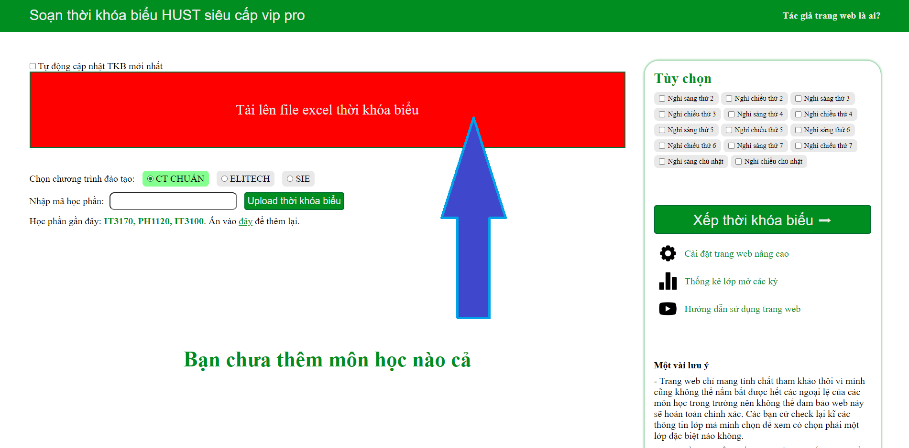

Sau đó chọn file thời khóa biểu, file này thường được nhà trường upload trên thông báo đăng ký lớp

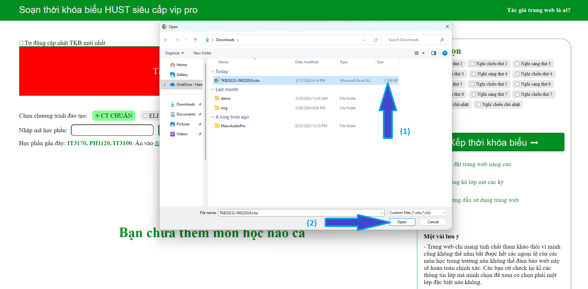

Nếu ô màu đỏ chuyển thành màu xanh như hình bên dưới là đã thành công!

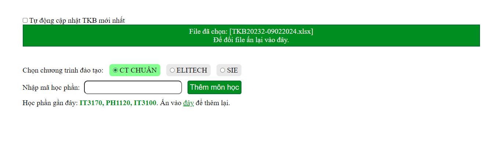

## 2. Chọn môn học

Nhấp vào ô input "Nhập mã học phần" và nhập các mã học phần mà mình mong muốn

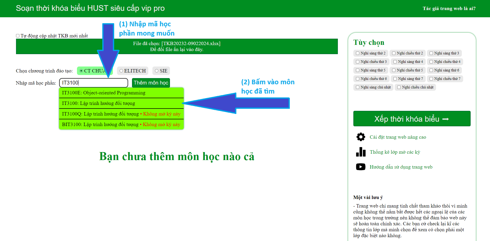

Nếu đã hiện môn học như hình bên dưới là đã thêm thành công

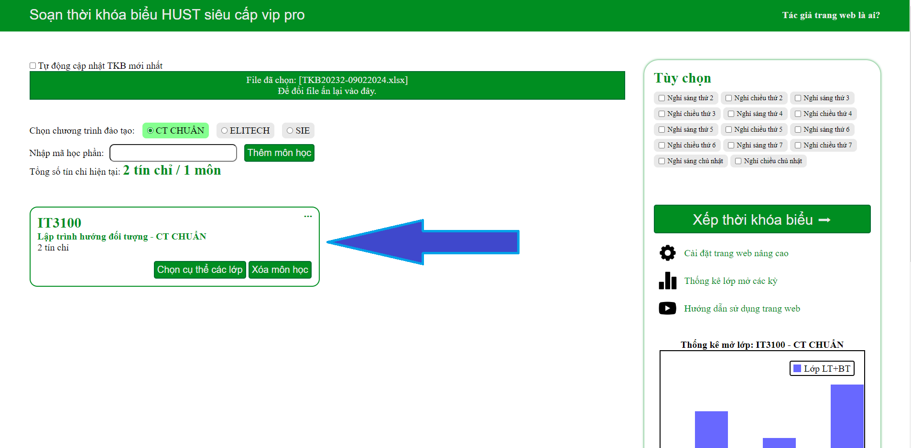

Sau đó, thêm nốt các môn học còn lại mà bạn muốn

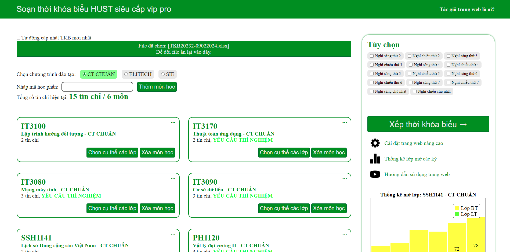

## 3. Bắt đầu xếp thời khóa niểu

Chọn các buổi nghỉ mong muốn, sau đó bấm vào nút "Xếp thời khóa biểu" để bắt đầu

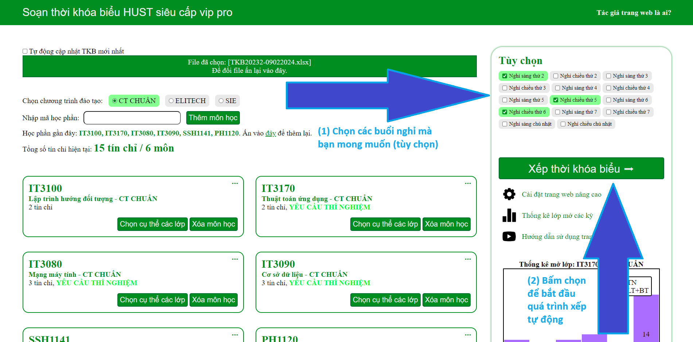

Sau một lúc trang web sẽ hiển thị tổng số cách chọn thời khóa biểu cho bạn và thông tin về mỗi cách chọn đó

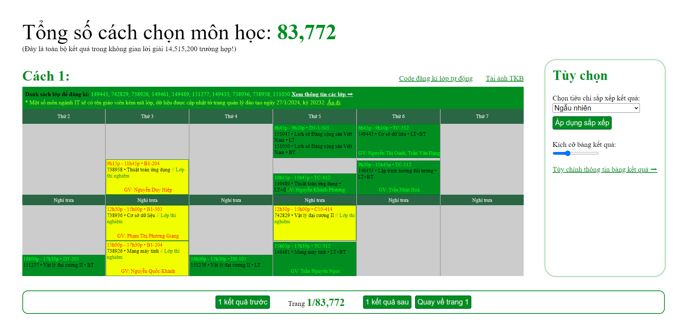

Vì thông thường sẽ có cực kỳ nhiều cách xếp, vậy nên bạn hãy chọn chức năng sắp xếp thời khóa biểu theo tiêu chí để các kết quả phù hợp hiển thị lên đầu

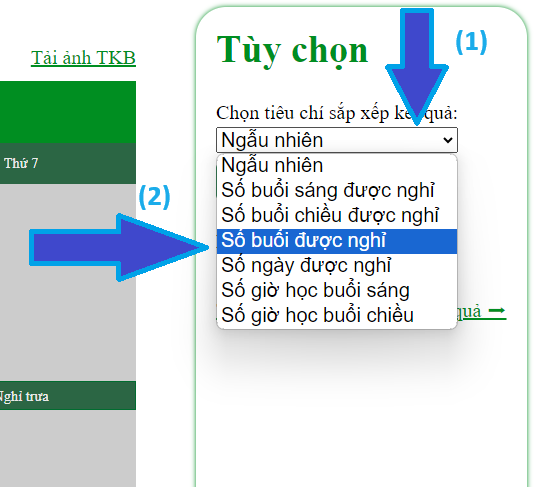

Cuối cùng bạn hãy chỉ việc cần chọn ra thời khóa biểu phù hợp nhất với mình và lưu lại và đừng quên sử dụng một loạt các tính năng có sẵn:

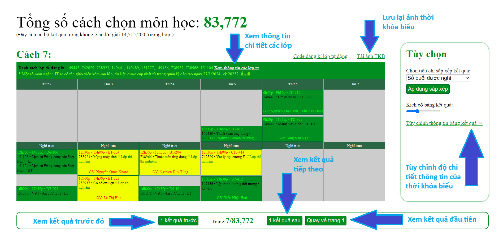

# Các chức năng nâng cao khác của trang web

Ngoài chức năng xếp thời khóa biểu ra thì trang web còn cung cấp hàng loạt chức năng tiện ích khác, giúp sinh viên nhiều hơn nữa trong quá trình sử dụng.

## 1. Thống kê mở lớp các kỳ của trường

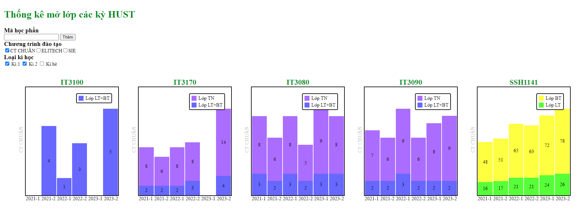

## 2. Chọn lớp mong muốn đối với mỗi môn học

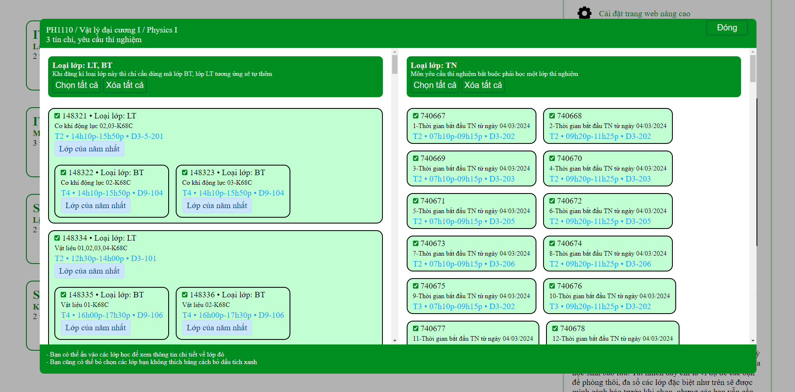

## 3. Cảnh báo các loại lớp đặc biệt

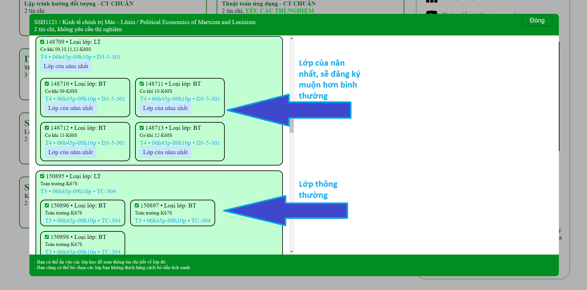

## 4. Giải thích các nguyên nhân đơn giản khiến cho không xếp được thời khóa biểu

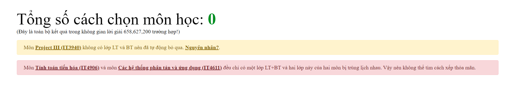

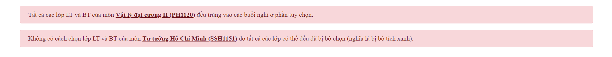

